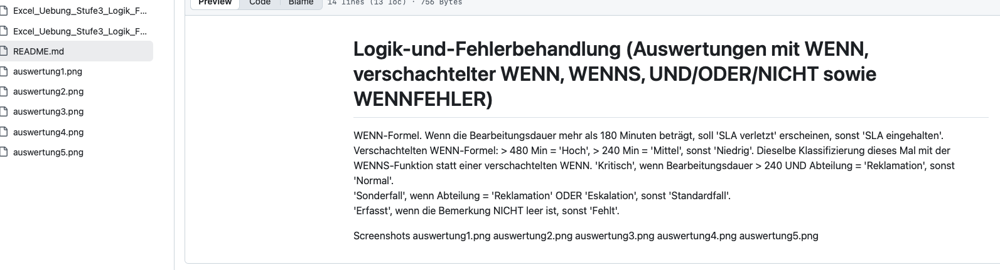
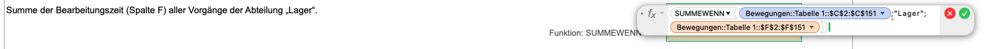
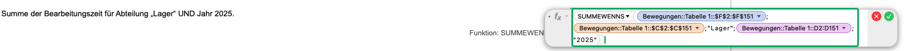
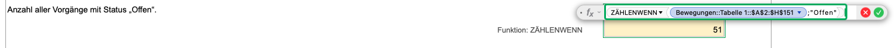
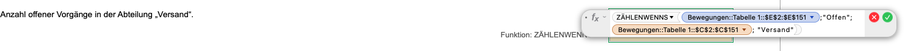
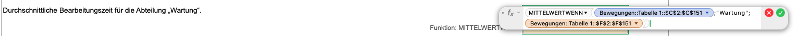
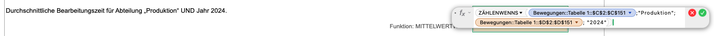
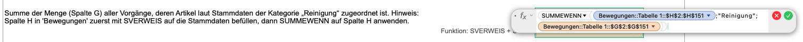
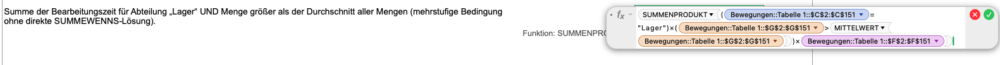

# Bedingte_Aggregation (Auswertungen von Stammdaten mit SUMMEWENN(S), ZÄHLENWENN(S), MITTELWERTWENN(S), Kombination mit SVERWEIS)

Summe der Bearbeitungszeit (Spalte F) aller Vorgänge der Abteilung „Lager“.

Summe der Bearbeitungszeit für Abteilung „Lager“ UND Jahr 2025.

Anzahl aller Vorgänge mit Status „Offen“.

Anzahl offener Vorgänge in der Abteilung „Versand“.

Durchschnittliche Bearbeitungszeit für die Abteilung „Wartung“.

Durchschnittliche Bearbeitungszeit für Abteilung „Produktion“ UND Jahr 2024.

Summe der Menge (Spalte G) aller Vorgänge, deren Artikel laut Stammdaten der Kategorie „Reinigung“ zugeordnet ist.

Summe der Bearbeitungszeit für Abteilung „Lager“ UND Menge größer als der Durchschnitt aller Mengen.

## Screenshots

